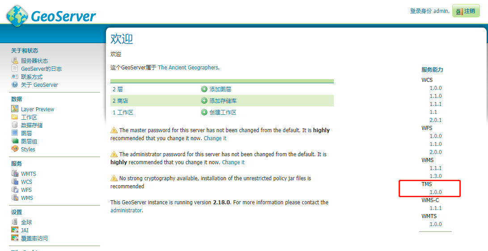
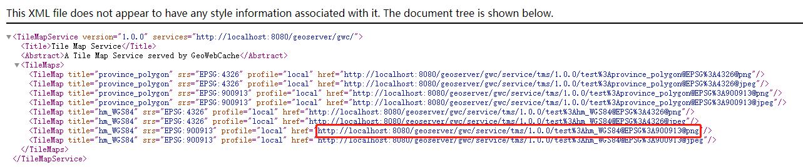

## Cesium结合Geoserver问题小结

- #### 缓存切片后无法找到切片数据

  ##### 解决方法：修改xml配置

  使用geoserver.war部署需修改配置文件，否则无法进行切片。

  - xml地址：geoserver\WEB-INF\web.xml

  - 添加代码（param-value节点中为切片数据存放地址）：

    ```xml
      <context-param>
        <param-name>GEOWEBCACHE_CACHE_DIR</param-name>
        <param-value>D:\study\server\geoserver_tomcat\webapps\geoserver\data\data\tiles</param-value>
      </context-param>
    ```

    完整示例代码连接： [web.xml](code\web.xml) 

    

- #### 影像数据无法存储至Geoserver

  ##### 解决方法：使用QGIS将影像数据导出为WGS84（4326）投影，在存储至Geoserver即可。

  

- #### cesium如何调用Geoserver切片(TMS格式)

  1. ##### 进入Geoserver首页,点击TMS

     

  2. ##### 选择相应切片的基础连接（cesium默认加载坐标系为EPSG:900913的数据）

     

  3. ##### Cesium中加载，加载URL为：基础连接+/{z}/{x}/{reverseY}.png

     ```javascript
     var urlTemplateImageryProvider = new Cesium.UrlTemplateImageryProvider({
         url : "http://192.168.43.197:8080/geoserver/gwc/service/tms/1.0.0/test%3Ahm_WGS84@EPSG%3A900913@png/{z}/{x}/{reverseY}.png"
     });
     viewer.imageryLayers.addImageryProvider(urlTemplateImageryProvider);
     ```

     

  4. ##### 若需加载WGS84坐标系切片，可选择EPSG:4326坐标系的基础连接，经上一步骤后，在Cesium中添加如下代码即可

     ```javascript
     tilingScheme: new Cesium.GeographicTilingScheme()
     ```

     完整加载代码如下：

     ```javascript
     var urlTemplateImageryProvider = new Cesium.UrlTemplateImageryProvider({
         url : "http://192.168.43.197:8080/geoserver/gwc/service/tms/1.0.0/test%3Ahm_WGS84@EPSG%3A4326@png/{z}/{x}/{reverseY}.png",
         tilingScheme: new Cesium.GeographicTilingScheme()
     });
     viewer.imageryLayers.addImageryProvider(urlTemplateImageryProvider);
     ```

  

- #### Cesium加载Geoserver服务出现跨域问题

  ##### 	解决方法：添加jar文件，修改xml配置。参考：https://blog.csdn.net/qq_40216244/article/details/109046931

  - geoserver\WEB-INF\lib目录下添加如下文件

      [cors-filter-1.7.jar](source\cesium加载geoserver跨域\cors-filter-1.7.jar) 

     [java-property-utils-1.9.jar](source\cesium加载geoserver跨域\java-property-utils-1.9.jar) 

  - geoserver\WEB-INF中的web.xml文件添加如下代码：

    ```xml
    <filter> 
        <filter-name>CORS</filter-name> 
        <filter-class>com.thetransactioncompany.cors.CORSFilter</filter-class> 
        <init-param>
            <param-name>cors.tagRequests</param-name>
            <param-value>true</param-value>
        </init-param>
    </filter> 
    <filter-mapping> 
        <filter-name>CORS</filter-name> 
        <url-pattern>/*</url-pattern> 
    </filter-mapping>
    ```

    完整示例代码连接： [web.xml](code\web.xml) 